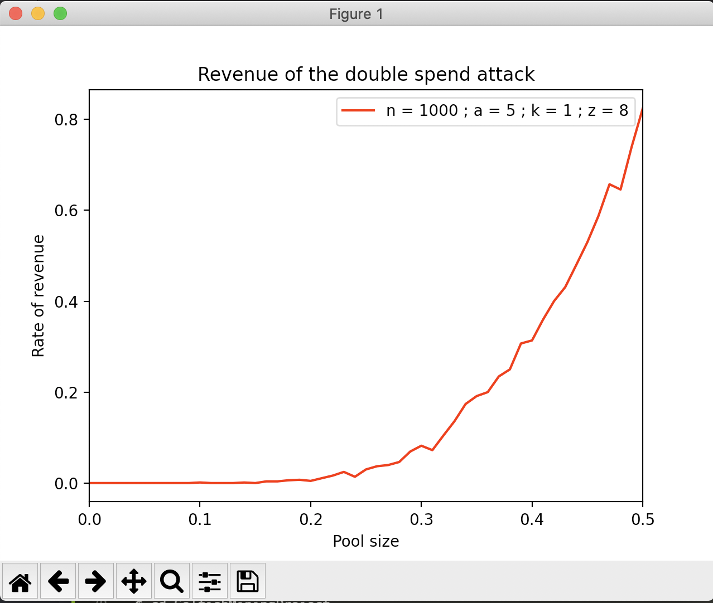
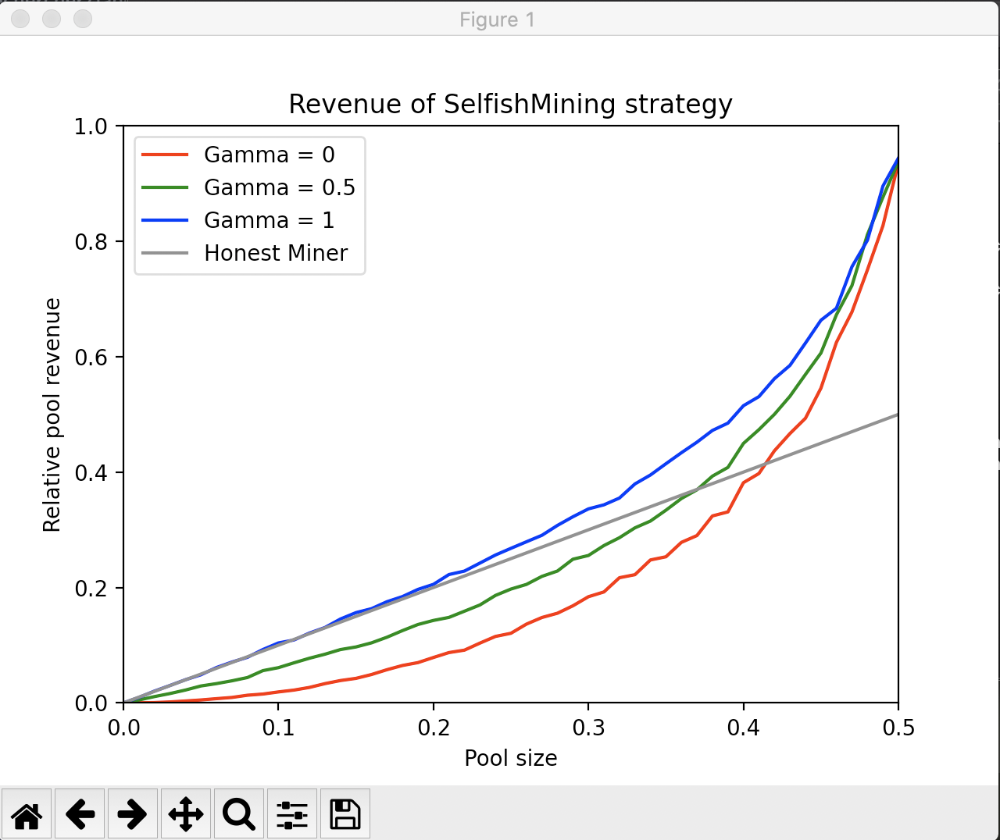

# Crypto-Finance 
## By Alec GUESSOUS and Alexandre PEREZ

</br>

## General Info

<p>
Ce projet scolaire est effectuer dans le cadre de notre formation d'ingenieur Fintech et Blockchain.
</p>
<p>
Le but de cet exercice est d'effectuer une simulation de l'attaque originelle de Staoshi et une simulation de l'attaque de minage égoïste afin de determiner le taux de rendement de la strategie, c'est à dire lorsque l'attaque est plus rentable que la stratégie honnete de minage.
</p>

</br>

## Sujet

### 1 - Simulation de l'attaque originelle de Satoshi


On imagine qu'un attaquant répète sans arrêt (ou un grand nombre de fois) l'attaque décrite par Satoshi Nakamoto dans son papier fondateur.

**Input :** nombre de cycles d'attaques (n), taux de hachage relatif (q), seuil de sécurité fixé par le vendeur i.e., nombre de confirmations (z), seuil de tolérance (A) i.e., retard maximal autorisé par l'attaquant sur la blockchain officielle, nombre de blocs préminés par l'attaquant au début de son attaque (k), montant de la double dépense (v). L'attaque de Satoshi correspond à k = 1.

**Output :** taux de rendement de la stratégie

Pour n, A, k, z fixés, tracer la courbe qui donne le taux de rendement de la stratégie en fonction de q. Tracer et donner la possibilité à un utilisateur de modifier simplement les constantes n, A, k ,z (équivalent du Manipulate sur Mathematica).

Identifier les regions où l'attaque est plus rentable que la stratégie honnête de minage

</br>

### 2 - Simulation de l'attaque de minage égoïste

On imagine qu'un attaquant répète sans arrêt (ou un grand nombre de fois) la stratégie déviante de minage égoïste.

**Input :** nombre de cycles d'attaques (n), taux de hachage relatiq (q), connectivité de l'attaquant(gamma).

**Output :** taux de rendement de la stratégie et durée avant que la stratégie ne devienne rentable.

Tracer la courbe qui donne le taux de rendrement de la stratégie en fonction de q et de gamma. Comparer au taux de rendement de la stratégie classique.

On prend en compte l'ajustement de difficulté dans le calcul du taux de rendement de la stratégie (on calcule le taux de rendement de la stratégie long-terme).

</br>

### Screenshot
<p align = "center">
Le resultat sera donné sous forme de graphique en fonction q (le taux de hashage relatif)
</br>
<p> Double Spending </p>

</br>
<p> Selfish Mining </p>

</p>
</br>

## Technologies

A list of technologies used within the project:
* [scipy](https://www.scipy.org/install.html): Version 1.6.0
* [matplotlib](https://matplotlib.org/3.3.3/users/installing.html): Version 3.3.3
* [numpy](https://numpy.org/): Version 1.19.4

</br>

## Installation

Double Spending 
```
$ git clone https://github.com/Nespetit/DoubleSpendAttack
$ cd ProjectsCryptofinance
$ pip install scipy
$ pip install matplotlib
$ pip install numpy
```

</br>

## Run the project

For windows :

```
$ python3 DoubleSpending.py
```
</br>

For MacOS :
```
$ python3 DoubleSpending.py
```
